# What is NBGrader?

NBGrader is a tool for managing homework, or assignments.

Normally, this is in the form of questions to test whether students can write `code` to solve problems.

<!-- TOC -->

- [What is NBGrader?](#what-is-nbgrader)
    - [Top level view of assignments](#top-level-view-of-assignments)
    - [nbgrader for students](#nbgrader-for-students)
        - [`Released assignments`](#released-assignments)
        - [`Downloaded assignments`](#downloaded-assignments)
            - [Working on assignments](#working-on-assignments)
            - [Submitting assignments](#submitting-assignments)
        - [`Submitted assignments`](#submitted-assignments)
        - [Folders you will see in your home folder](#folders-you-will-see-in-your-home-folder)
    - [nbgrader for instructors](#nbgrader-for-instructors)
        - [Creating an assignment](#creating-an-assignment)
        - [Folders you will see in your home folder](#folders-you-will-see-in-your-home-folder-1)
    - [How to write an assignment](#how-to-write-an-assignment)

<!-- /TOC -->

Nbgrader views the world in two ways: `Instructors` can set & mark assignments; `students` complete assignments & submit for marking.

In Noteable, `Instructors` are `students` with more options.

## Top level view of assignments

At the very top level, the life-cycle of a notebooks is _create_, _release_, _fetch_, _submit_, _grade_, _feedback_:

* Instructors _create_ and _release_
* Students _fetch_ and _submit_
* Instructors _grade_ and _feedback_

## nbgrader for students

When you start a notebook, you have three _tabs_ top-left - the `Assignments` one is where you interact with assignments released to your course

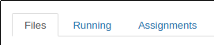

This page has three areas: `Released assignments`, `Downloaed assignment`, and `Submitted assignments`.

### `Released assignments`

New assignments will be listed here

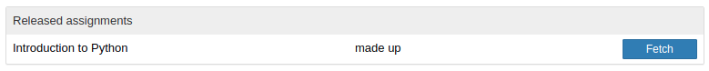

Clicking on `[ Fetch ]` will download it for you to work on.

### `Downloaded assignments`

Assignments you have downloaded are listed here.

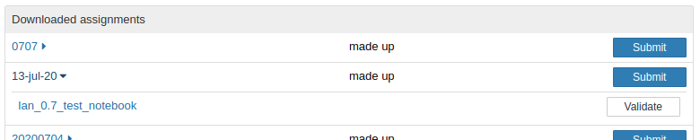

Notice the assignments are listed in alphabetical order, and that each assignment has a right-facing arrow.

If you click on the name of the assignment (or arrow-head) the assignment will _open_ to show you the notebook(s) for you to work on.

Clicking on the notebook name will open the notebook.

#### Working on assignments

When in a notebook, you will only be able to edit certain cells - the ones where you're providing answers (either code, or free-form text)

Remember to **save** your notebook before closing it - if you don't, then you'll submit the last auto-saved version.... which is probably missing important work.

#### Submitting assignments

Having worked on an assignment, and saved it, you can return to the `assignments` tab and check your work by clicking on the `[ validate ]` button.

You may edit, save, validate; edit, save, validate as often as you need until you are ready to submit your work.

Click on the `[ Submit ]` button to return your work to the Instructor.

**Note**, if you realise you have an error (or just want to change the way you do something), you can edit, save, validate... and re-submit - the instructor will be given your last submitted notebook when then collect notebooks for marking.

### `Submitted assignments`

This is where all your submissions are listed

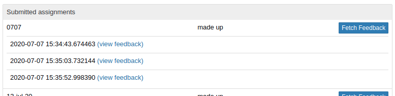

There are two things of note here:

1. All your submissions are grouped under their assignments, and timestamped - the instructor _will_ see the timestamp for the submission they're marking.
1. There may be feedback available for submissions, and this is where you fetch it.

### Folders you will see in your home folder

All files are stored in your home folder, so you can find them directly:

* `Fetched` assignments will be in `<couse_code>/<assignment_code>/`

    If you delete the `<assignment_code>`, your system will think you've not fetched the assignments, and allow you to re-fetch it.

* `feedback` is stored in `<couse_code>/<assignment_code>/feedback/<timestamp>` - which means if your instructor marks two different submissions, you may have multiple versions of the feedback.

    The link in the `assignments` tab should take you to the right one.

## nbgrader for instructors

When you start a notebook, you have four _tabs_ top-left:

* the `Formgrader` one is whwere you create, and mark, assignments.
* the `Assignments` one is where you interact with assignments released to your course (like students do.)

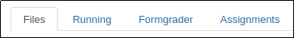

The `formgrader` pane is broken into two sections - The _management_ menu, and The _working area_.

When you start, the _management_ menu will be set to `Manage Assignments`, and the _working area_ will have all your assignments [for this course] listed

* The _management_ menu:

    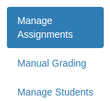

* The _Manage Assignments_ table:

    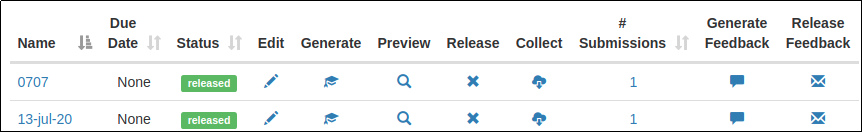

### Creating an assignment

Step one is to create a new assignment in your local `gradebook` database:

Click on the `Formgrader` tab to access the management tools

**Note** - This opens a new tab in your browser

1. Click on the `Add New Assignment` link at the bottom of the table:

    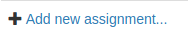

2. Fill in the resultant pop-up form:

    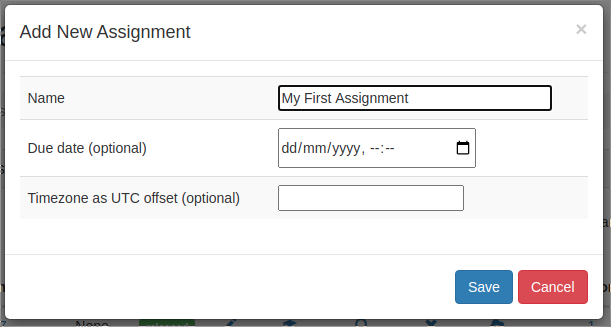

3. This will create a new entry in the assignments table:

    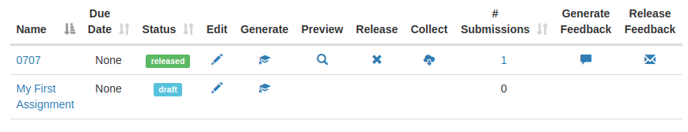

    * The _Edit_ pen allows you to change the name of the assignment, or it's `Due Date`

4. Click on the _Name_ of the assignment to actually add content.

    **Note** - This opens a new tab in your browser

    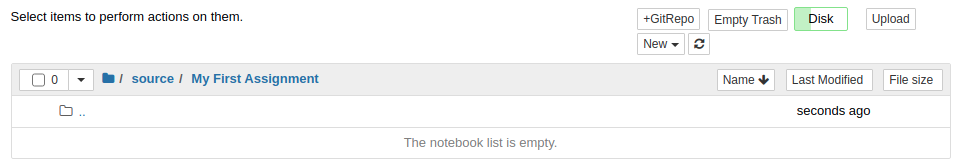

    Notice that you are in a sub-folder - assignment names need to be unique, simply
    because of this folder structure.

    How you add a notebook depends on how you work. Gnerally I make my assignment
    notebook beforehand, and upload it here.

    These notebooks should be complete - ie include tests, sample code for answers,
    and everything needed for the notebook to run without errors.

    See [How to write an assignment]() below for details on this.

    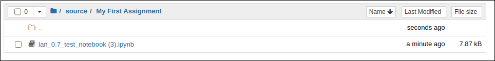

    You may add as many notebooks and/or data files as you wish - but keep everything in the same folder.

    Once finished adding files, you may close the browser tab.

5. Back at the assignments table, you are now ready to create the version that students will get.

    Click on the hat in the `Generate` column, and the system should respons with a `Success` popup:

    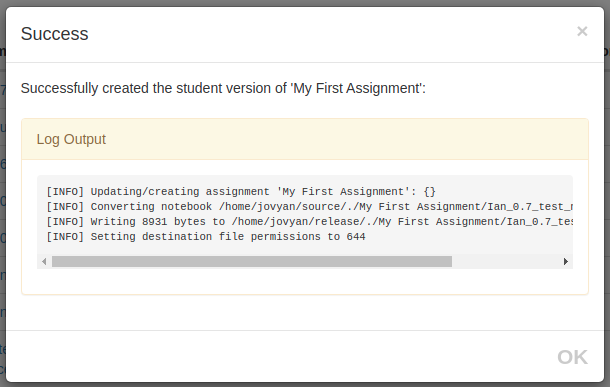

    If there are errors, go back and edit the source file (see step 4), save, and re-run `Generate`

    This will result in a new version, which you `Preview` before `Release`-ing

    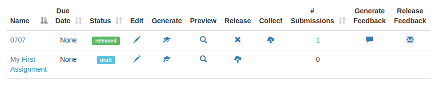

    * If you click on the spyglass under `Preview`, you can look at the version that will be [has been?] released

        Notice that you are in a different sub-folder to the `source` file.
        This also opens a new tab in your browser. Close it once you've finished previwing
        
    * If you click on the _arrow to cloud_ symbol in the `Release` column, this will release the notebook
    to students.

    **Note** - Once you have done this, it is impractical (not not advisable) to re-release the notebook:
    Students may already have downloaded a copy, and will not see an updated version.

    `Release`ing the notebook will result in a `Success` popup:

    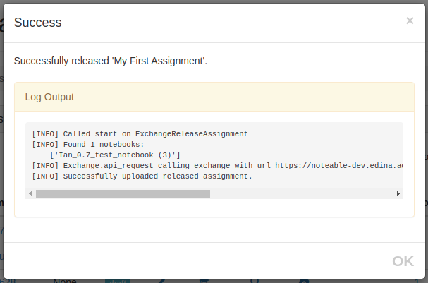

6. Back at the assignments table, you can see your assignment has been released:

    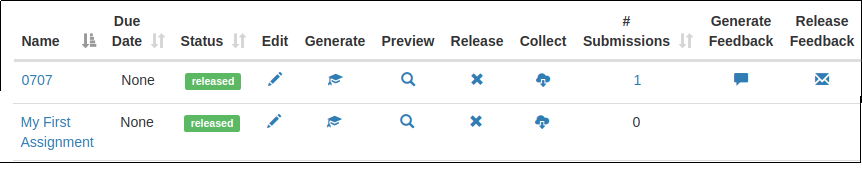

7. .. collection ..

8. .. grading ..

9. .. feedback ..

### Folders you will see in your home folder

All files are stored in your home folder, so you can find them directly:

* `Fetched` assignments will be in `<couse_code>/<assignment_code>/`

    If you delete the `<assignment_code>`, your system will think you've not fetched the assignments, and allow you to re-fetch it.

* `feedback` is stored in `<couse_code>/<assignment_code>/feedback/<timestamp>` - which means if your instructor marks two different submissions, you may have multiple versions of the feedback.

    The link in the `assignments` tab should take you to the right one.

## How to write an assignment
